# 🚀 AI Starter Kit - Intelligent AWS GPU Deployment

<div align="center">


**Enterprise-grade AI workflow automation with intelligent deployment, cross-region analysis & 70% cost optimization**

[](https://aws.amazon.com/)
[](https://www.docker.com/)
[](https://n8n.io/)
[](https://ollama.ai/)

*Deploy production-ready AI workflows with intelligent GPU selection, cross-region analysis, multi-architecture support, and 70% cost optimization*

</div>

---

## 🎯 What You Get

### 🤖 **AI-Powered Workflows**
- **n8n** - Visual workflow automation with AI agents
- **Ollama** - Local LLM inference (DeepSeek-R1:8B, Qwen2.5-VL:7B)
- **Qdrant** - High-performance vector database
- **Crawl4AI** - Intelligent web scraping with LLM extraction

### 🧠 **Intelligent Deployment**
- **🤖 Auto-selection** of optimal GPU configurations
- **💰 Real-time pricing** analysis across multiple instance types and regions
- **🏗️ Multi-architecture** support (Intel x86_64 & ARM64 Graviton2)
- **🎯 Price/performance** optimization with budget constraints
- **🌍 Cross-region analysis** for optimal pricing and availability

### 💰 **Cost Optimization**
- **70-75% cost savings** with AWS Spot instances
- **Auto-scaling** based on GPU utilization
- **Real-time pricing** via AWS Pricing API
- **Intelligent resource allocation** for optimal configurations

---

## 🚀 Quick Start

### Prerequisites
- ✅ AWS CLI configured with appropriate permissions
- ✅ Docker and Docker Compose installed
- ✅ AWS account with GPU instance quota

### 1️⃣ **Configure Secrets**
```bash
# Set up SSM parameters
aws ssm put-parameter --name "/aibuildkit/OPENAI_API_KEY" --value "your-key" --type SecureString
aws ssm put-parameter --name "/aibuildkit/n8n/ENCRYPTION_KEY" --value "your-key" --type SecureString
aws ssm put-parameter --name "/aibuildkit/POSTGRES_PASSWORD" --value "your-password" --type SecureString
aws ssm put-parameter --name "/aibuildkit/WEBHOOK_URL" --value "https://your-domain.com" --type SecureString
```

### 2️⃣ **Deploy with Intelligent Selection**
```bash
# 🤖 Auto-select optimal configuration (recommended)
./scripts/aws-deployment.sh

# 🌍 Cross-region analysis for best pricing
./scripts/aws-deployment.sh --cross-region

# 💰 Custom budget optimization
./scripts/aws-deployment.sh --max-spot-price 1.50

# 🎚️ Force specific architecture
./scripts/aws-deployment.sh --instance-type g4dn.xlarge    # Intel x86_64
./scripts/aws-deployment.sh --instance-type g5g.2xlarge   # ARM64 Graviton2
```

### 3️⃣ **Access Your Services**
After deployment, configure DNS CNAME records:
- **n8n Workflows**: `https://n8n.geuse.io`
- **Qdrant Vector DB**: `https://qdrant.geuse.io`
- **Direct Access**: `http://YOUR-IP:5678` (n8n)

---

## 📊 Intelligent Cost Analysis

### 🎯 **Multi-Configuration Pricing**

| Configuration | Architecture | On-Demand | Spot Instance | Price/Perf | Monthly Savings |
|---------------|--------------|-----------|---------------|------------|-----------------|
| **g5g.xlarge** | ARM64 Graviton2 | $0.95/hr | $0.38/hr | **171.1** 🎯 | **$410.40** |
| **g4dn.xlarge** | Intel x86_64 | $1.19/hr | $0.45/hr | 155.6 | $324.00 |
| **g5g.2xlarge** | ARM64 Graviton2 | $1.90/hr | $0.75/hr | 106.7 | $324.00 |
| **g4dn.2xlarge** | Intel x86_64 | $2.38/hr | $0.89/hr | 95.5 | $428.40 |

**🤖 Intelligent Selection**: Automatically chooses g5g.xlarge for best price/performance ratio

---

## 🏗️ Architecture Overview

```mermaid
graph TB
    subgraph "AWS Cloud"
        CF[CloudFront CDN]
        ALB[Application Load Balancer]
        ASG[Auto Scaling Group]
        EFS[Elastic File System]
    end
    
    subgraph "Intelligent Selection"
        SELECTOR[🤖 Config Selector]
        PRICING[💰 Price Analyzer]
        ARCH[🏗️ Architecture Detector]
        REGION[🌍 Region Analyzer]
    end
    
    subgraph "GPU Instance"
        subgraph "Docker Containers"
            N8N[n8n Workflows]
            OLLAMA[Ollama LLMs]
            QDRANT[Qdrant Vector DB]
            CRAWL4AI[Crawl4AI Scraper]
            POSTGRES[PostgreSQL]
        end
        
        GPU[NVIDIA T4/T4G GPU]
        MONITOR[Cost Monitor]
    end
    
    SELECTOR --> ASG
    PRICING --> SELECTOR
    ARCH --> SELECTOR
    REGION --> SELECTOR
    CF --> ALB
    ALB --> ASG
    ASG --> GPU
    GPU --> EFS
    OLLAMA --> GPU
    MONITOR --> ASG
```



---

## 💡 Local Development

For local testing and development, use the CPU profile:

```bash
# Start services locally (CPU-only)
docker compose --profile cpu up

# Services will be available at:
# - n8n: http://localhost:5678
# - Ollama: http://localhost:11434
# - Qdrant: http://localhost:6333
# - Crawl4AI: http://localhost:11235
```

---

## 🔧 Configuration

### Environment Variables
```bash
# Required SSM Parameters
/aibuildkit/OPENAI_API_KEY          # OpenAI API key
/aibuildkit/n8n/ENCRYPTION_KEY      # n8n encryption key
/aibuildkit/POSTGRES_PASSWORD       # Database password
/aibuildkit/WEBHOOK_URL             # Webhook base URL

# Optional Parameters
/aibuildkit/n8n/CORS_ENABLE         # CORS settings
/aibuildkit/n8n/CORS_ALLOWED_ORIGINS # Allowed origins
/aibuildkit/n8n/COMMUNITY_PACKAGES_ALLOW_TOOL_USAGE # Enable community packages
/aibuildkit/n8n/USER_MANAGEMENT_JWT_SECRET # JWT secret for user management
```

### Resource Allocation

#### **G4DN Instances (Intel x86_64 + NVIDIA T4)**
```yaml
# g4dn.xlarge: 4 vCPUs, 16GB RAM, 1x T4
# g4dn.2xlarge: 8 vCPUs, 32GB RAM, 1x T4

CPU Allocation:
- postgres: 1.5 vCPUs (37.5%)
- n8n: 1.0 vCPUs (25%)
- ollama: 2.5 vCPUs (62.5%) - Primary compute
- qdrant: 1.5 vCPUs (37.5%)
- monitoring: 0.5 vCPUs (12.5%)

Memory Allocation:
- ollama: 10GB (62.5%) - Primary memory user
- postgres: 3GB (18.75%)
- qdrant: 3GB (18.75%)
- monitoring: 512MB (3.2%)

GPU Memory (T4 16GB):
- ollama: 14.4GB (90%)
- system reserve: 1.6GB (10%)
```

#### **G5G Instances (ARM64 Graviton2 + NVIDIA T4G)**
```yaml
# g5g.xlarge: 4 vCPUs, 8GB RAM, 1x T4G
# g5g.2xlarge: 8 vCPUs, 16GB RAM, 1x T4G

CPU Allocation:
- postgres: 1.0 vCPUs (25%)
- n8n: 0.8 vCPUs (20%)
- ollama: 2.0 vCPUs (50%) - Primary compute
- qdrant: 1.0 vCPUs (25%)
- monitoring: 0.2 vCPUs (5%)

Memory Allocation:
- ollama: 5GB (62.5%) - Primary memory user
- postgres: 1.5GB (18.75%)
- qdrant: 1.5GB (18.75%)
- monitoring: 256MB (3.2%)

GPU Memory (T4G 16GB):
- ollama: 14.4GB (90%)
- system reserve: 1.6GB (10%)
```

---

## 📊 Monitoring & Analytics

### GPU Monitoring
```bash
# Real-time GPU metrics
curl http://YOUR-IP:6333/healthz  # Qdrant health
curl http://YOUR-IP:11434/api/tags  # Ollama models
curl http://YOUR-IP:5678/healthz  # n8n health
```

### Intelligent Selection Demo
```bash
# See intelligent selection in action (no AWS required)
./scripts/simple-demo.sh

# Test enhanced selection with cross-region analysis (no AWS required)
./scripts/test-intelligent-selection.sh --comprehensive

# Generate cost report
python3 scripts/cost-optimization.py --action report

# Monitor optimization
tail -f /var/log/cost-optimization.log
```

### CloudWatch Metrics
- **GPU Utilization** - Auto-scaling trigger
- **Cost per Hour** - Real-time cost tracking
- **Instance Health** - Availability monitoring
- **Workload Efficiency** - Performance analytics

---

## 🚨 Spot Instance Management

### Interruption Handling
- **2-minute warning** from AWS before termination
- **Graceful shutdown** of AI workloads
- **Automatic backup** to EFS
- **ASG scaling** to replace terminated instances

### Availability Strategy
- **Multi-AZ deployment** across availability zones
- **Cross-region analysis** for optimal pricing and capacity
- **Intelligent instance selection** (g4dn.xlarge, g4dn.2xlarge, g5g.xlarge, g5g.2xlarge)
- **Primary/secondary AMI fallbacks** for each configuration
- **Auto-scaling groups** with health checks
- **CloudFront CDN** for global availability
- **Automatic region switching** to best available option

---

## 🆘 Troubleshooting

### Common Issues

| Issue | Solution |
|-------|----------|
| **Spot instance not launching** | Check spot price limits and availability |
| **Intelligent selection fails** | Verify AMI availability in selected region |
| **InvalidAMIID.Malformed errors** | Use `--cross-region` for better region selection |
| **GPU not detected** | Verify NVIDIA drivers and Docker GPU runtime |
| **EFS mount failures** | Check security groups and VPC configuration |
| **High costs** | Review auto-scaling policies and spot pricing |
| **Deployment script errors** | Check AWS CLI permissions and region settings |
| **ARM64 compatibility issues** | Ensure containers support ARM64 architecture |
| **Region capacity constraints** | Enable cross-region analysis with `--cross-region` |

### Debug Commands
```bash
# Test intelligent selection (no AWS required)
./scripts/simple-demo.sh

# Check service status
docker compose -f docker-compose.gpu-optimized.yml ps

# View logs
docker compose -f docker-compose.gpu-optimized.yml logs ollama

# Monitor GPU usage
nvidia-smi

# Check cost optimization
python3 scripts/cost-optimization.py --action report

# Verify AWS resources
aws ec2 describe-instances --filters "Name=instance-state-name,Values=running"

# Check intelligent selection details
./scripts/aws-deployment.sh --help

# Test AMI selection fixes and cross-region analysis
./scripts/test-intelligent-selection.sh --comprehensive
```

---

## 📚 Documentation

For detailed information, see the documentation in the [`docs/`](docs/) directory:

- **[Development Guide](docs/CLAUDE.md)** - Comprehensive development guide with architecture overview, commands, and troubleshooting
- **[Deployment Improvements](docs/DEPLOYMENT_IMPROVEMENTS.md)** - Comprehensive improvements to deployment system, optimization scripts, and validation tools
- **[Intelligent Deployment Summary](docs/INTELLIGENT_DEPLOYMENT_SUMMARY.md)** - Overview of AI-powered deployment system with intelligent configuration selection
- **[AMI Selection Fixes](docs/AMI_SELECTION_FIXES.md)** - Detailed fixes for AMI selection issues and cross-region analysis features

---

## 🧹 AWS Console Cleanup Guide

### **Automatic Cleanup**
The deployment scripts include automatic cleanup on error, but you should verify all resources are properly removed.

### **Manual Cleanup Checklist**

#### **1. EC2 Instances**
- **Location**: AWS Console → EC2 → Instances
- **Look for**: Instances with names containing `ai-starter-kit`, `ai-starter-kit-simple`, or `ai-starter-kit-ondemand`
- **Action**: Terminate any running instances

#### **2. Security Groups**
- **Location**: AWS Console → EC2 → Security Groups
- **Look for**: Security groups named:
  - `ai-starter-kit-sg`
  - `ai-starter-kit-simple-sg`
  - `ai-starter-kit-ondemand-sg`
- **Action**: Delete security groups (may need to wait for dependencies)

#### **3. Key Pairs**
- **Location**: AWS Console → EC2 → Key Pairs
- **Look for**: Key pairs named:
  - `ai-starter-kit-key`
  - `ai-starter-kit-key-simple`
  - `ai-starter-kit-ondemand-key`
- **Action**: Delete key pairs

#### **4. Elastic File System (EFS)**
- **Location**: AWS Console → EFS → File systems
- **Look for**: File systems with names containing `ai-starter-kit`
- **Action**: Delete file systems and mount targets

#### **5. Application Load Balancers**
- **Location**: AWS Console → EC2 → Load Balancers
- **Look for**: Load balancers with names containing `ai-starter-kit`
- **Action**: Delete load balancers

#### **6. Target Groups**
- **Location**: AWS Console → EC2 → Target Groups
- **Look for**: Target groups with names containing `ai-starter-kit`
- **Action**: Delete target groups

#### **7. CloudFront Distributions**
- **Location**: AWS Console → CloudFront → Distributions
- **Look for**: Distributions with comments containing `ai-starter-kit`
- **Action**: Disable and delete distributions

#### **8. IAM Roles and Policies**
- **Location**: AWS Console → IAM → Roles
- **Look for**: Roles named:
  - `ai-starter-kit-role`
  - `ai-starter-kit-simple-role`
  - `ai-starter-kit-ondemand-role`
- **Action**: Delete roles and associated instance profiles

- **Location**: AWS Console → IAM → Policies
- **Look for**: Policies named:
  - `ai-starter-kit-custom-policy`
- **Action**: Delete custom policies

#### **9. Systems Manager Parameters**
- **Location**: AWS Console → Systems Manager → Parameter Store
- **Look for**: Parameters with prefix `/aibuildkit/`
- **Action**: Delete parameters (optional - keep if reusing)

#### **10. CloudWatch Log Groups**
- **Location**: AWS Console → CloudWatch → Log groups
- **Look for**: Log groups with names containing `ai-starter-kit`
- **Action**: Delete log groups

### **Cleanup Verification Commands**
```bash
# Check for remaining resources
aws ec2 describe-instances --filters "Name=tag:Name,Values=*ai-starter-kit*" --query 'Reservations[].Instances[].InstanceId'
aws ec2 describe-security-groups --filters "Name=group-name,Values=*ai-starter-kit*" --query 'SecurityGroups[].GroupId'
aws efs describe-file-systems --query 'FileSystems[?contains(Name, `ai-starter-kit`)].FileSystemId'
aws elbv2 describe-load-balancers --query 'LoadBalancers[?contains(LoadBalancerName, `ai-starter-kit`)].LoadBalancerArn'
```

### **Troubleshooting Cleanup Issues**
- **Security Group Dependencies**: Wait 5-10 minutes for all resources to fully detach
- **EFS Mount Targets**: Ensure all mount targets are deleted before deleting file system
- **IAM Role Dependencies**: Remove role from instance profile before deleting role
- **CloudFront Distributions**: Must be disabled before deletion

---

## 🤝 Contributing

1. Fork the repository
2. Create a feature branch (`git checkout -b feature/amazing-feature`)
3. Commit your changes (`git commit -m 'Add amazing feature'`)
4. Push to the branch (`git push origin feature/amazing-feature`)
5. Open a Pull Request

---

## 📄 License

This project is licensed under the MIT License - see the [LICENSE](LICENSE) file for details.

---

<div align="center">

**Built with ❤️ for intelligent, cost-effective AI deployment by [G E U S E](HTTPS://geuse.io)**

[](https://github.com/michael-pittman/001-starter-kit)
[](https://github.com/michael-pittman/001-starter-kit)

</div> 
