# Components

## Core Module Component
**Responsibility:** Provides essential utilities and shared functionality across all modules

**Key Interfaces:**
- Variable management and persistence
- Structured logging with multiple levels
- Error handling and recovery mechanisms
- Input validation and sanitization
- Resource registry for tracking all AWS resources
- Dependency group management for library loading

**Dependencies:** None (foundational component)

**Technology Stack:** Bash scripting with JSON for configuration storage

## Infrastructure Module Component
**Responsibility:** Manages AWS infrastructure resources and their lifecycle

**Key Interfaces:**
- VPC creation and configuration with multi-AZ support
- EC2 instance provisioning and management (spot and on-demand)
- Security group and IAM role configuration
- EFS filesystem setup and mounting
- Application Load Balancer setup and configuration
- CloudFront CDN distribution management

**Dependencies:** Core Module, AWS CLI, AWS credentials

**Technology Stack:** Bash scripting, AWS CLI, CloudFormation

## Compute Module Component
**Responsibility:** Handles all EC2 compute operations with intelligent instance selection

**Key Interfaces:**
- AMI selection based on architecture and region
- Spot instance pricing and optimization
- Instance provisioning with fallback strategies
- Auto-scaling group management
- Instance lifecycle management
- Security configuration for compute resources
- Launch template creation and management

**Dependencies:** Core Module, Infrastructure Module, AWS CLI

**Technology Stack:** Bash scripting, AWS CLI, EC2 Spot APIs

## Application Module Component
**Responsibility:** Manages application deployment and configuration

**Key Interfaces:**
- Docker service configuration and deployment
- AI service stack setup (n8n, Ollama, Qdrant, Crawl4AI)
- Health monitoring and readiness checks
- Service configuration management
- Base application utilities

**Dependencies:** Core Module, Infrastructure Module, Docker

**Technology Stack:** Bash scripting, Docker, Docker Compose

## Deployment Module Component
**Responsibility:** Orchestrates the deployment process and manages deployment state

**Key Interfaces:**
- Deployment orchestration and workflow management
- State management and persistence
- Rollback capabilities and recovery
- User data script generation for EC2 instances

**Dependencies:** Core Module, Infrastructure Module, Compute Module, Application Module

**Technology Stack:** Bash scripting, JSON state files, progress indicators

## Monitoring Module Component
**Responsibility:** Provides health checks, metrics collection, and monitoring capabilities

**Key Interfaces:**
- Resource health validation
- Performance metrics collection
- Deployment status monitoring
- Alert generation and notification

**Dependencies:** Core Module, AWS CloudWatch

**Technology Stack:** Bash scripting, AWS CloudWatch, custom health checks

## Errors Module Component
**Responsibility:** Provides structured error handling with clear messages and recovery strategies

**Key Interfaces:**
- Error type definitions and categorization
- Clear error message generation
- Recovery strategy recommendations
- Error context preservation

**Dependencies:** Core Module

**Technology Stack:** Bash scripting, structured error codes

## Cleanup Module Component
**Responsibility:** Manages resource cleanup and failure recovery

**Key Interfaces:**
- Resource cleanup orchestration
- Failed deployment recovery
- Orphaned resource identification
- Safe resource deletion with dependency checking

**Dependencies:** Core Module, Infrastructure Module

**Technology Stack:** Bash scripting, AWS CLI

## CLI Interface Component
**Responsibility:** Provides user interface and command processing

**Key Interfaces:**
- Command parsing and validation
- Progress indicator display
- Help system and documentation
- User input handling and feedback

**Dependencies:** Core Module, Deployment Orchestrator

**Technology Stack:** Bash scripting, terminal UI libraries, color coding

## Component Diagrams

```mermaid
graph TB
    subgraph "User Layer"
        CLI[CLI Interface]
    end
    
    subgraph "Deployment Layer"
        DEPLOY[Deployment Module]
        STATE[State Management]
        ROLL[Rollback]
        USERDATA[User Data]
    end
    
    subgraph "Application Layer"
        APP[Application Module]
        DOCKER[Docker Manager]
        AI[AI Services]
        HEALTH[Health Monitor]
        CONFIG[Service Config]
    end
    
    subgraph "Compute Layer"
        COMPUTE[Compute Module]
        AMI[AMI Selection]
        SPOT[Spot Optimizer]
        PROV[Provisioner]
        AUTO[Autoscaling]
        LAUNCH[Launch Manager]
        LIFECYCLE[Lifecycle]
        CSEC[Compute Security]
    end
    
    subgraph "Infrastructure Layer"
        INFRA[Infrastructure Module]
        VPC[VPC]
        EC2[EC2]
        ALB[ALB]
        CDN[CloudFront]
        EFS[EFS]
        IAM[IAM]
        SEC[Security Groups]
    end
    
    subgraph "Core Layer"
        CORE[Core Module]
        VARS[Variables]
        LOG[Logging]
        VAL[Validation]
        REG[Registry]
        DEPS[Dependencies]
        INST[Instance Utils]
    end
    
    subgraph "Support Layer"
        MON[Monitoring Module]
        ERR[Errors Module]
        CLEAN[Cleanup Module]
    end
    
    CLI --> DEPLOY
    DEPLOY --> STATE
    DEPLOY --> ROLL
    DEPLOY --> USERDATA
    DEPLOY --> APP
    DEPLOY --> COMPUTE
    DEPLOY --> INFRA
    
    APP --> DOCKER
    APP --> AI
    APP --> HEALTH
    APP --> CONFIG
    
    COMPUTE --> AMI
    COMPUTE --> SPOT
    COMPUTE --> PROV
    COMPUTE --> AUTO
    COMPUTE --> LAUNCH
    COMPUTE --> LIFECYCLE
    COMPUTE --> CSEC
    
    INFRA --> VPC
    INFRA --> EC2
    INFRA --> ALB
    INFRA --> CDN
    INFRA --> EFS
    INFRA --> IAM
    INFRA --> SEC
    
    CORE --> VARS
    CORE --> LOG
    CORE --> VAL
    CORE --> REG
    CORE --> DEPS
    CORE --> INST
    
    DEPLOY --> MON
    DEPLOY --> ERR
    DEPLOY --> CLEAN
    
    APP --> CORE
    COMPUTE --> CORE
    INFRA --> CORE
    MON --> CORE
    ERR --> CORE
    CLEAN --> CORE
``` 

